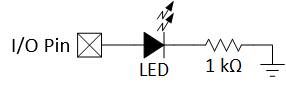
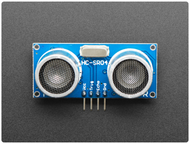
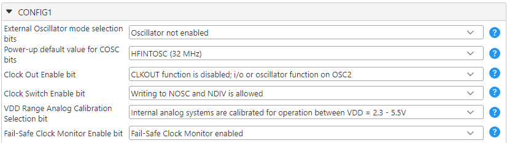
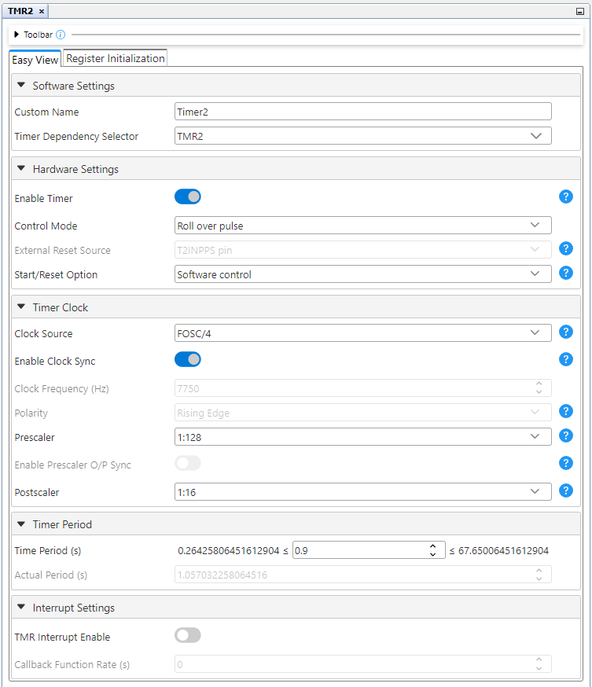
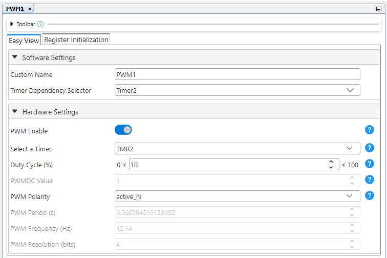
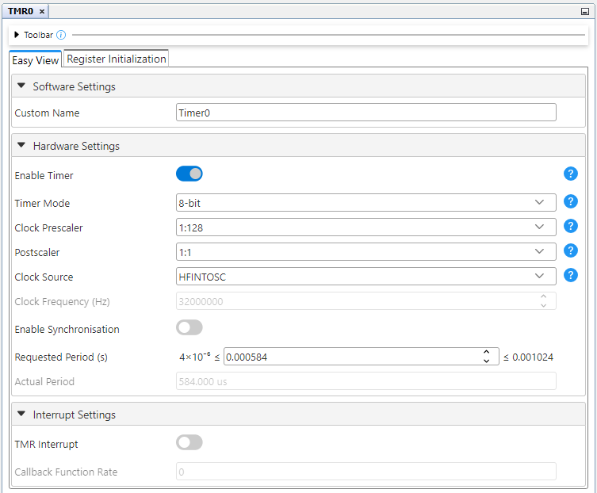
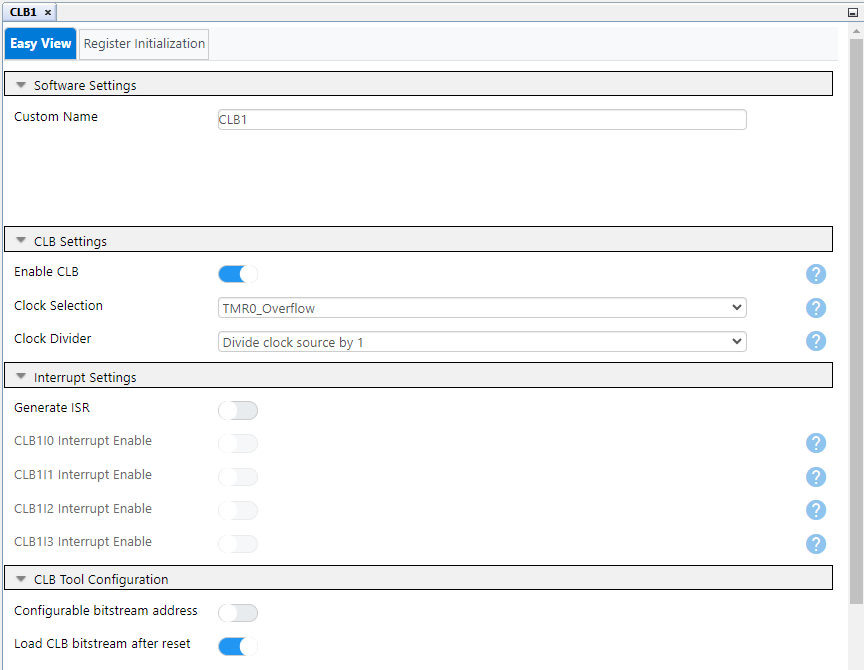
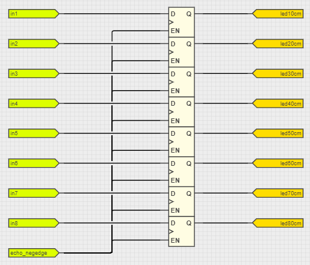
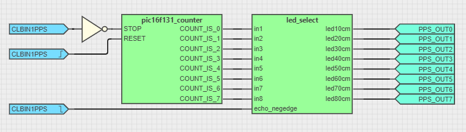
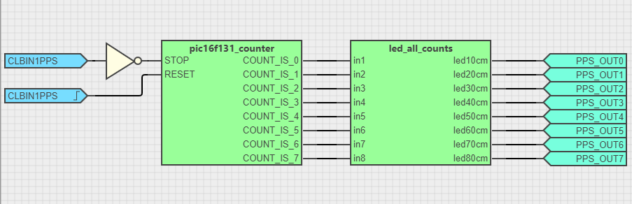

# Zero-Software Ultrasonic Distance Sensing — Use Case for Configurable Logic Block (CLB) Using the PIC16F13145 Microcontroller with MCC Melody

This repository provides 1 project that implements a rangefinder using the HC-SR04, and displaying the results on a eight LED's.

The CLB peripheral is a collection of logic elements that can be programmed to perform a variety of digital logic functions. The logic function may be completely combinatorial, sequential or a combination of the two, enabling users to incorporate hardware-based custom logic into their applications. 

The HC-SR04 is a standard ultrasonic sensor that can be used for object detection and distance sensing. This is accomplished by the transmitter sending a signal, and making a calculation based off the time it took the signal to get back to the reciever. 

## Related Documentation

More details and code examples on the PIC16F13145 can be found at the following links:

- [PIC16F13145 Product Page](https://www.microchip.com/en-us/product/PIC16F13145?utm_source=GitHub&utm_medium=TextLink&utm_campaign=MCU8_Apps_PIC16F13145&utm_content=pic16f13145-quadrature-decoder-up-down-mplab-mcc&utm_bu=MCU08)
- [PIC16F13145 Code Examples on Discover](https://mplab-discover.microchip.com/v2?dsl=PIC16F13145)
- [PIC16F13145 Code Examples on GitHub](https://github.com/microchip-pic-avr-examples/?q=PIC16F13145)

## Software Used

- [MPLAB X IDE v6.20 or newer](https://www.microchip.com/en-us/tools-resources/develop/mplab-x-ide?utm_source=GitHub&utm_medium=TextLink&utm_campaign=MCU8_Apps_PIC16F13145&utm_content=pic16f13145-quadrature-decoder-up-down-mplab-mcc&utm_bu=MCU08)
- [MPLAB® XC8 v2.46 or newer](https://www.microchip.com/en-us/tools-resources/develop/mplab-xc-compilers?utm_source=GitHub&utm_medium=TextLink&utm_campaign=MCU8_Apps_PIC16F13145&utm_content=pic16f13145-quadrature-decoder-up-down-mplab-mcc&utm_bu=MCU08)
- [PIC16F1xxxx_DFP v1.25.389 or newer](https://packs.download.microchip.com/)

## Hardware Used

- The [PIC16F13145 Curiosity Nano Development board](https://www.microchip.com/en-us/development-tool/EV06M52A?utm_source=GitHub&utm_medium=TextLink&utm_campaign=MCU8_Apps_PIC16F13145&utm_content=pic16f13145-quadrature-decoder-up-down-mplab-mcc&utm_bu=MCU08) is used as a test platform:
- The HC-SR04 Ultraonic distance sensor
- Seven LEDs
- 7 Resistors for LEDs (rec. 2.2kΩ)

## Operation


### All LEDs ON
 

### One LED ON
 

Above are 2 examples of the CLB displaying configurablity, first we have the project being displayed on multiple LEDs and following that is another being displayed only on one. In this example the CLB measures the duration of the echo pin, using the Timer 0 overflow


## Hardware Setup

1. Attach 7 LEDs in the following fashion.



You can attach the LEDs to any I/O but the pins used in this example are 
| PIN | LED # |
|--|--|
|RC6|1|
|RC7|2|
|RB7|3|
|RB5|4|
|RC0|5|
|RC1|6|
|RA4|7|
|RA5|8|

2. The HC-SR04 is connected to the Nano Board via 4 pins



| Nano Pin | HC-SR04 Pin |
|--|--|
|VTG|V<sub>CC</sub>|
|RB6|Trig|
|RB4|Echo|
|GND|GND|

**Important Note:** The HC-SR04 is uses 5 volts for inputs and outputs it is recommended to switch the Nano to 5V mode to avoid BOR. 

## MCC Setup

1. Configuration Bits:
 -  Osillator not enabled
 -  HFINTOSC (32MHz)
 -  CLKOUT function disabled
 -  Interal analog systems are calibrated for operation between VDD = 2.3 - 5.5V

 

### 2. TMR2


 
 

### 3. PWM1

 

### 4. TMR0
 
  - 
 

### 5. NVM

  - Auto-Configured for CLB

### 6. CRC

  - Auto-Configured for CLB

### 7. CLB

-  Clock Selection: TMR0_Overflow

 

There are 2 configurations of this project. (Single LED and All LEDs) All previous settings will be the exact same for both these examples, the only change is the CLB bitstream.

# All LEDs Active

For Single LED results the following submodule should be added within a `New Schematic`



The final result should look like this 




# Single LED Active

For Single LED results the following submodule should be added within a `New Verilog`


```
module led_all_counts(in1, in2, in3, in4, in5, in6, in7, in8, led10cm, led20cm, led30cm, led40cm, led50cm, led60cm, led70cm, led80cm);
input in1, in2, in3, in4, in5, in6, in7, in8;
output led10cm, led20cm, led30cm, led40cm, led50cm, led60cm, led70cm, led80cm;

assign led10cm = in1 | in2 | in3 | in4 | in5 | in6 | in7 | in8;
assign led10cm = in2 | in3 | in4 | in5 | in6 | in7 | in8;
assign led10cm = in3 | in4 | in5 | in6 | in7 | in8;
assign led10cm = in4 | in5 | in6 | in7 | in8;
assign led10cm = in5 | in6 | in7 | in8;
assign led10cm = in6 | in7 | in8;
assign led10cm = in7 | in8;
assign led10cm = in8;
endmodule
```

The final result should look like this 




